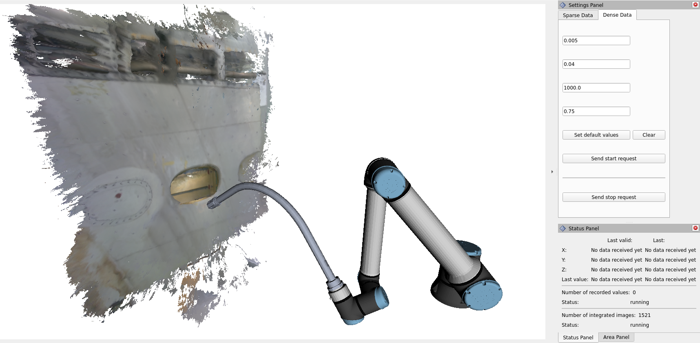
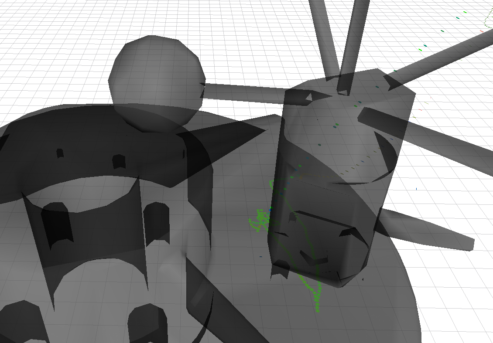

# Vinspect

Vinspect (short for "visualized inspection") provides a multiple functionalities that support an inspection process.

The inspection process can be performed by a human (with a tracked sensor), by a robot or by a combination of both.
It also is possible to use multiple sensor types together. 
These can produce sparse measurements (e.g. a ultrasonic sensor) or dense measurements (e.g. a camera).

All measurements can be shown together with a reference object (e.g. based on the CAD model of the part that is inspected).
Doing so will allow you to see the live coverage of this parts, both by the single measurements and a reconstructed 3D mesh based on camera images.
This allows an easier inspection process for the operator and ensures that all areas where inspected.

The `vinspect` package provides the core software of Vinspect and can be integrated into various applications. 
Additionally, we also provide a ROS2 interface which we recommend for easy integration into ROS2 based systems.

## Features
- Visualization of large amount of measurements
- Clear coverage visualization
- Saving/loading of the inspection data
- Fast visualization and data access times due to usage of octrees
- Simple to integrate C++ library
- Python bindings
- DICONDE export

### Planned Features
- Recording of the robot's pose during recording of a data point
  
## Requirements for Usage
- Known pose of the sensor (e.g. by using a tracking system or forward kinematics of the robot)
- For coverage visualization, a reference mesh (e.g. from the CAD model) is helpful

## Installation and Usage

We recommend using Vinspect together with the ROS2 interface that we provide.
If you prefer to use it without the ROS2 interface, you can include it into your project like any other C++ library.
Additionally, there are Python bindings which allow you integration into Python code.

Beware that Vinspect depends on the pose_tree library which is included as a git submodule and you need to pull this accordingly(`git submodule init && git submodule update`).
You will also need to have Open3D installed on your system ([Open3D install instructions](https://www.open3d.org/docs/release/compilation.html)). 
In addition to that, you also need RocksDB, OpenCV, nlohmann_json, fmt, pybind11, Protobuf, TBB, Git and Eigen3 (on Ubuntu you can run `sudo apt install librocksdb-dev libeigen3-dev libopencv-dev nlohmann-json3-dev libfmt-dev pybind11-dev libprotobuf-dev libtbb-dev git`).

You can instantiate an object of the `Inspection` class and specify what types of sensors you want to use in the constructor.
Afterward, you can add data, visualize it and access it (see following sections).

### Adding Data
As explained above, the inspection can hold sparse data (single sensor measurement) and dense data (e.g. RGB-D images).
Each type is handled separately.
You can call the `addSparseMeasurement()` function to add a new single sensor measurement to the inspection.
Similarly, you can call the `addImage()` function to add a new camera image.

### Visualizing
You can visualize the current state of the inspection in two different ways.
You can get a 3D mesh reconstruction based on the integrated RGB-D images by calling the `extractDenseReconstruction()` function.
The sparse data is visualized by creating a mesh of points (actually octagons) that merge multiple sensor measurements that are closest together.
This mesh can be obtained by calling the `createMesh()` method of the `SparseMesh` class.

### Getting Data
The `Inspection` class offers multiple methods to directly access the data.
These are based on the underlying octree data structure and are, therefore, fast.
This includes getting the
- closest sensor measurement (`getClosestSparseMeasurement()`)
- measurements in a specific area (`getSparseMeasurementsInRadius()`) 
  
### Saving and Loading Data
The `Inspection` class continuously saves the inspection data to prevent any data loss.
The data can be loaded instantiating an inspection with the same save path.
It is then also possible to continue the inspection and appending new data to the loaded file.

An inspection can also be exported in the DICONDE format for further analysis or documentation purposes.

## ROS 2

We provide a ROS 2 package which wraps the `Inspection` class to connect it to the ROS2 ecosystem.

Example of an inspection with RGB-D data from a robot shown in RViz2.

Example of an inspection with a handheld ultrasonic sensor, using the setup described in Wilken et al. "Localisation of Ultrasonic NDT Data Using Hybrid Tracking of Component and Probe".

## Installation

Clone these packages in your colcon workspace (beware that the `vinspect` package has a git submodule that might need to instantiate, so use the `--recursive` flag when cloning) and call `colcon build`. 
Missing dependencies can be installed via rosdep.

## Usage
This package provides a node that you can launch with specifying multiple parameters (see below).
By setting these parameters, it is possible to subscribe on multiple different sensor inputs.
These will then be aggregated and visualized using RViz2 with additional plugins (see below).

### Recording
Currently, two different types of sensor inputs are supported:
- `vinspect_msgs/Sparse` messages 
- `RGB-D` images (via color and depth `sensor_msgs/Image` messages)
  
For the `Sparse` messages, it is expected that the user implements an additional preprocessing node 
that takes in some sort of point meassurement (e.g. from a ultrasonic sensor) and connects it to the
pose in which the measurement was taken.
Additionally, each sensor needs to have a unique ID.
The message can contain multiple data entries and also a custom color in which this data should be displayed.
This approach was taken since there is no standard message for all types of sensor inputs.
As soon as the Vinspect node is started, it will record these messages.

The `RGB-D` messages are only recorded after calling the `/vinspect/start_reconstruction` service
to prevent recording images before the camera is at the correct position.
This service can also be called with the Vinspect settings RViz2 plugin.
It is possible to use multiple cameras at the same time.

### Visualization
The visualization is integrated into RViz2.
Both, the sparse measurement visualization and the 3D reconstruction based on RGB-D data, are 
published as `visualization_msgs/Marker` messages.
They can be displayed with the standard RViz marker visualization.
Additionally, the vinspect_rviz_plugins package provides three plugins for RViz2:
- a settings plugin which allows you to configure the visualization of both sparse and dense data
- a status panel which provides the current status of the inspection, e.g. how many measurements 
  have been taken
- an area plugin which works together with an interactive marker which allows you to investigate
  measurements at a certain location. The interactive marker needs to launched with 
  `ros2 run vinspect_ros2 selection_marker.py` (or from your launch file)

### Parameters

See [vinspect_parameters.yaml](ros2/vinspect_ros2/src/vinspect_parameters.yaml) for the list of parameters including descriptions, valid ranges, etc..

## Demo
You can get a better impression on how this package works with the following demos.

### Sparse Data
Launch the inspection:
`ros2 launch vinspect_ros2 sparse_demo.launch.py`

You should now be presented with the RViz GUI including the special Vinspect plugins (on the right side).
There should be a reference box visible, if not try adjusting the transparency on the right.

Start a dummy publisher:
`ros2 run vinspect_ros2 dummy_publisher.py`

Now randomly generated measurements should appear in form of octagons.

Stop the software by pressing `Ctrl+C`.

Run again the same command to load the previous data and allow continuing the inspection:
`ros2 launch vinspect_ros2 sparse_demo.launch.py`

You can move the interactive marker to investigate the measurement values.
You can adapt settings in the settings panel.

### Dense Data
You can see how the software is started in the `dense_demo.launch.py` file.

**TODO provide link to a rosbag to allow actually reconstructing**

# Contributing
Contributions are welcome (issues as well as pull requests).
We plan on further developing and using this software in the future and are happy for any 
contributions from the community.
We follow the [ROS2 code style](https://docs.ros.org/en/rolling/The-ROS2-Project/Contributing/Code-Style-Language-Versions.html).

# Thanks
Thanks to [@attcs] for implementing the [Octree library](https://github.com/attcs/Octree/) which creatly facilitated the creation of this software.

Thanks to [@marrts] whose [industrial_reconstruction ROS2 package](https://github.com/ros-industrial/industrial_reconstruction) inspired the TSDF based 3D reconstruction part of Vinspect.

Thanks to [@marip8] whose [REACH software](https://github.com/ros-industrial/reach)  inspired the clear seperation between core and ROS2 code.

